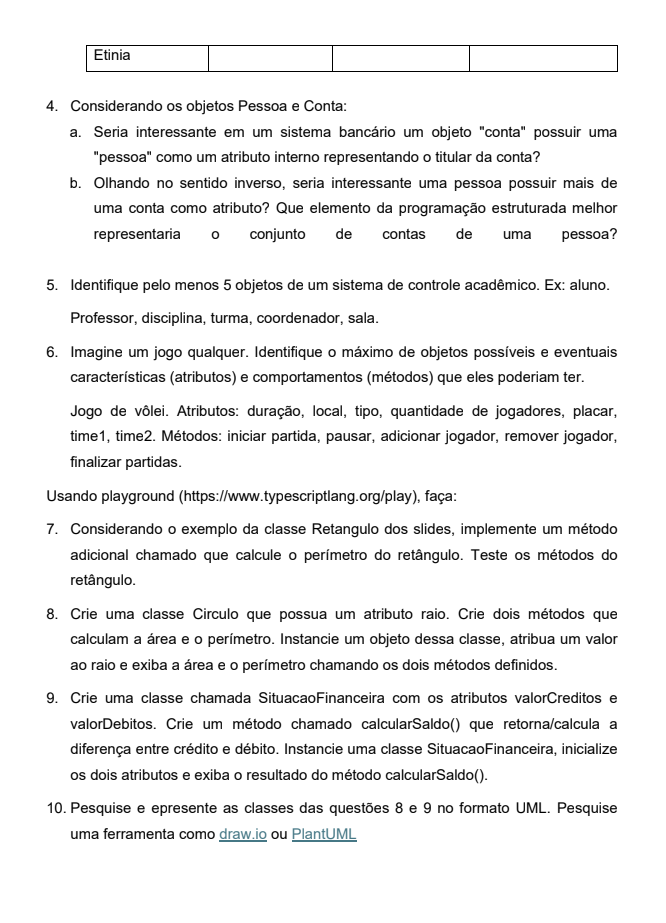

# Exercício 01 (Extra) - Programação Orientada a Objetos

**Instituição:** Instituto Federal de Educação, Ciência e Tecnologia do Piauí (IFPI)
**Curso:** Análise e Desenvolvimento de Sistemas (ADS)
**Disciplina:** Programação Orientada a Objetos
**Professor:** Ely

---

## 📄 Questões do Exercício

Abaixo estão as páginas do documento original contendo todas as questões propostas.

### Página 01

### Página 02

---

## 📚 Tabela de Resoluções

A tabela abaixo serve como um índice, com links diretos para cada resolução no repositório.

| Questão | Descrição Resumida | Arquivo de Resolução |
| :---: | :--- | :---: |
| 01 | Diferença entre classe e objeto. | [questao_01.md](./questao_01.md) |
| 02 | Conceito de atributos e métodos. | [questao_02.md](./questao_02.md) |
| 03 | Análise sobre abstração. | [questao_03.md](./questao_03.md) |
| 04 | Relação entre Pessoa e Conta. | [questao_04.md](./questao_04.md) |
| 05 | Objetos de um sistema acadêmico. | [questao_05.md](./questao_05.md) |
| 06 | Objetos de um jogo. | [questao_06.md](./questao_06.md) |
| 07 | Implementar perímetro do Retângulo. | [questao_07.ts](./questao_07.ts) |
| 08 | Classe `Circulo`. | [questao_08.ts](./questao_08.ts) |
| 09 | Classe `SituacaoFinanceira`. | [questao_09.ts](./questao_09.ts) |
| 10 | Diagramas UML. | [questao_10.puml](./questao_10.puml)   [questao_10_diagramas.png](./questao_10_diagramas.png) |

---
**Autor:** marcosgabrielms
